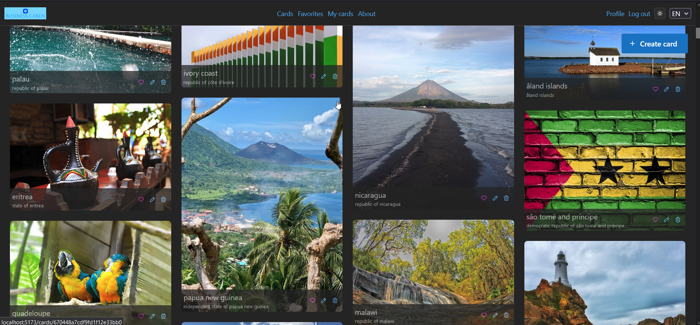
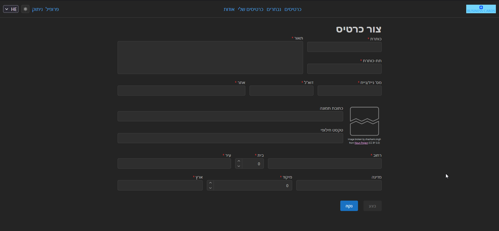
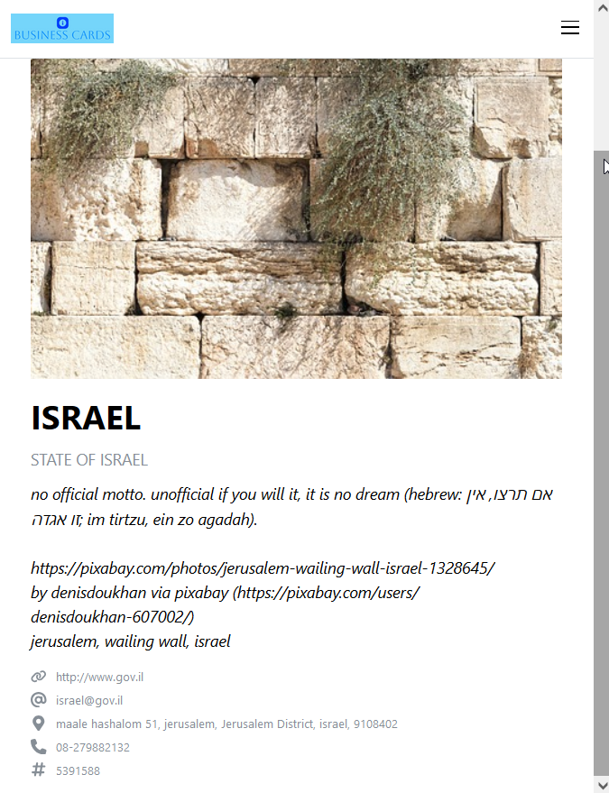

# Cards app

This is a front-end app for a database of business cards.

The app supports various operations for different user roles: CRUD, bookmarking ("like"/"unlike").

Features a multilingual interface, responsiveness (not hard with Mantine), and light/dark themes.

## Tech stack:

* [Typescript](https://www.typescriptlang.org/)
* [React](https://react.dev/)
* [React Router](https://reactrouter.com/en/main), including [loaders](https://reactrouter.com/en/main/start/overview#data-loading) and [actions](https://reactrouter.com/en/main/start/overview#data-mutations)
* [Mantine UI](https://mantine.dev/)
* [Zod](https://zod.dev/) - Typescript-friendly validations
* [Masonic](https://github.com/jaredLunde/masonic?tab=readme-ov-file#rendercomponentprops) - high-performace React masonry layout library

## Installation

`npm i`

## Running

`npm run dev`

## Environment variables

The following variables are defined in a `.env` file.

| Variable | Description |
| -- | -- |
| `VITE_API_BASEURL` | The url to the server API |

To locally override the values of these variables, create a `.env.local` file in the root folder setting the local values for the variables; [Vite will use the values from `.env.local` over `.env`](https://vitejs.dev/guide/env-and-mode#env-files). Because `.env.local` will be ignored by `.gitignore`, it's perfectly safe to include API secrets in it.

To use the requests in `server.http` with VS Code REST client, [define an evironment with the appropriate variables](https://github.com/Huachao/vscode-restclient?tab=readme-ov-file#environment-variables), as follows:

| Variable | Description |
| -- | -- |
| `apiUrl` | The url to the server API |
| `adminToken` | The server-generated token for a valid admin user |
| `adminUserId` | The user id of user marked with `isAdmin` equal to `true` |

